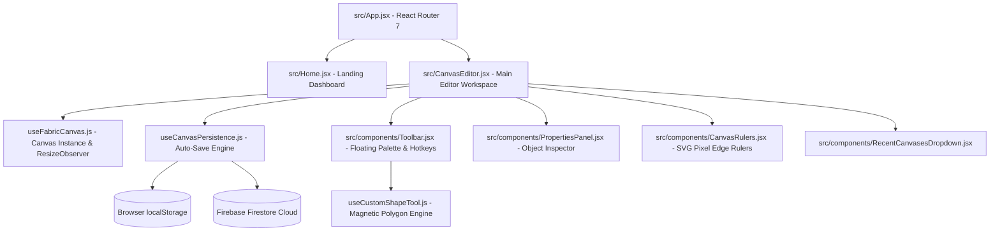

# Codebase Architecture & Technical Reference Guide

An exhaustive guide to the technical architecture, component breakdown, custom hooks, persistent data pipelines, event systems, state management, and edge-case handling across `canvas2D`.

---

## 1. System Architecture Overview

`canvas2D` is structured into three primary architectural tiers:
1. **View Tier (`src/Home.jsx`, `src/CanvasEditor.jsx`, `src/components/`):** React components managing layout structure, SVG topbar/ruler rendering, interactive property panels, and floating controls.
2. **Logic & Hook Tier (`src/hooks/`):** Custom hooks decoupling Fabric canvas lifecycle management, multi-point polygon snapping physics, and dual-layer local/cloud persistence.
3. **Service & Storage Tier (`src/lib/`):** Firestore database SDK wrappers and `localStorage` recent document cache handlers.

---

## 2. Pages & Routing (`src/`)

### `src/App.jsx`
- **Responsibility:** Configures top-level client-side routing between the home dashboard and individual canvas editors.
- **Routes:**
  - `/` -> Renders `<Home />`
  - `/canvas/:canvasId` -> Renders `<CanvasEditor />`
- **Design Rationale:** Uses dynamic URL parameter `/canvas/:canvasId` rather than query parameters so canvas URLs can be directly bookmarked or shared via clipboard.

### `src/Home.jsx`
- **Responsibility:** Dashboard displaying recent document cards and an integrated "+ New" creation tile.
- **Key State:** `recentList` (cached canvases from localStorage), `isCreating` (in-flight creation flag), `errorMessage`, `copiedId` (transient copied tile ID).
- **Non-Obvious Implementation:**
  - **Optimistic Creation:** Calls `doc(collection(db, 'canvases')).id` to generate a Firestore document ID on the client and writes to `localStorage` *before* navigating, so route transition is instant (`0ms` lag) without waiting for network ACK.
  - **Asynchronous Sync:** Fires background `{ name: 'Untitled', createdAt: serverTimestamp() }` to Firestore with a swallowed `.catch(() => {})` handler so offline users face no blocking UI.

### `src/CanvasEditor.jsx`
- **Responsibility:** Main workspace page coordinating the artboard, floating toolbar, rulers, status bar, zoom controls, and canvas title editing.
- **Key State:** `hasObjects` (toggles empty artboard guide), `isEditingTitle`/`titleInput` (inline document rename), `coords` (`{x, y}` cursor position in scene space), `isCopied`, `zoomPercent`.
- **Non-Obvious Implementation:**
  - **Scene vs. Screen Coordinates:** Calculates cursor position using Fabric v6+'s `fabricCanvas.getScenePoint(e)` (fallback to `getPointer(e)`) to ensure coordinates reflect true canvas space regardless of CSS zoom or pan offsets.
  - **Ruler Crosshair Clearing:** Subscribes to both canvas `mouse:out` and artboard container `mouseleave` to set `coords` to `null`, preventing frozen crosshair markers on rulers when mouse exits artboard.
  - **Centered Viewport Zoom:** Zooms around `fabricCanvas.getCenterPoint()` rather than `(0, 0)` so scaling remains centered relative to the visible viewport (`40%` to `250%`).
  - **Pre-navigation Flush & Reset:** When triggering "New Canvas" via topbar dropdown, `handleCreateNewCanvas` awaits `save()` to flush edits, clears `fabricCanvas` immediately, and resets `hasObjects` before navigating.

---

## 3. Components (`src/components/`)

### `src/components/Toolbar.jsx`
- **Responsibility:** Floating drawing tool palette managing tool selection, primitive shape creation, color picking, manual canvas saving, and keyboard hotkeys.
- **Key Props:** `fabricCanvas`, `onSave`.
- **Key State:** `activeTool` (`'select' | 'custom' | 'pen'`), `color` (active hex string), `savedFeedback` (transient checkmark flag).
- **Non-Obvious Implementation:**
  - **Input Shielding on Hotkeys:** Global `keydown` listener verifies `document.activeElement` is not an `<input>`, `<textarea>`, or contentEditable element, and ensures `activeObj.isEditing` is false before executing shortcuts (`V`, `R`, `C`, `L`, `T`, `P`, `Del`, `Ctrl+S`, `Ctrl+D`).
  - **PencilBrush Binding:** Fabric freehand drawing requires setting `canvas.isDrawingMode = true` and instantiating `fabric.PencilBrush(canvas)`.
  - **ActiveSelection Duplication:** To clone a multi-selection (`activeSelection`), objects are re-parented to canvas individually and `setCoordinates()` is invoked to prevent bounding box desynchronization.

### `src/components/PropertiesPanel.jsx`
- **Responsibility:** Contextual inspector floating on the right edge that binds to the selected canvas object to adjust fill/stroke color, font weight (bold), font style (italic), and font size.
- **Key Props:** `fabricCanvas`.
- **Key State:** `activeObject`, `fillColor`, `isBold`, `isItalic`, `fontSize`, `isTextObject`.
- **Non-Obvious Implementation:**
  - **Color Normalization via 2D Canvas Context:** Uses `ctx.fillStyle = color; return ctx.fillStyle` to convert arbitrary named CSS strings (e.g. `blue`, `rgb(...)`) to standard `#rrggbb` hex format required by native `<input type="color">`.
  - **Text Substring Formatting:** Checks `obj.isEditing` and applies changes via `obj.setSelectionStyles()` as well as top-level properties so highlighted text substrings format correctly inside textboxes.
  - **7-Event Synchronization:** Listens to `selection:created`, `selection:updated`, `selection:cleared`, `object:modified`, `object:scaling`, `text:selection:changed`, and `text:changed` to update inputs whenever shapes are modified externally.

### `src/components/CanvasRulers.jsx`
- **Responsibility:** Renders SVG pixel coordinate rulers along the top and left edges of the canvas container with mouse tracker lines.
- **Key Props:** `containerRef`, `coords` (`{x, y}` cursor position or `null`).
- **Key State:** `dimensions` (`{ width, height }`).
- **Non-Obvious Implementation:**
  - Uses `ResizeObserver` attached to `containerRef` to measure container client dimensions dynamically.
  - Tracker lines render only when `coords.x` and `coords.y` fall within container bounds `[0, width]` and `[0, height]` to prevent SVG overflow artifacts.

### `src/components/RecentCanvasesDropdown.jsx`
- **Responsibility:** Secondary menu in topbar providing current canvas ID with copy button, new canvas creation trigger, and list of recently opened documents.
- **Key Props:** `currentCanvasId`, `onNewCanvas`.
- **Non-Obvious Implementation:**
  - **Lazy Loading:** Queries `getRecentCanvases()` from `localStorage` only when dropdown menu flips open (`isOpen === true`).
  - **Outside Click Dismissal:** Attaches a `mousedown` listener to `window` and uses `dropdownRef.current.contains(e.target)` to close menu on external clicks.

### `src/components/SaveStatus.jsx`
- **Responsibility:** Displays minimal status indicator badge (`✓ Saved`, `Saving…`, `Unsaved changes`, or error) in the topbar.

### `src/components/Icons.jsx`
- **Responsibility:** Centralized repository of lightweight SVG icon components (`LogoIcon`, `CursorIcon`, `SquareIcon`, `CircleIcon`, `TriangleIcon`, `LineIcon`, `PolygonIcon`, `TypeIcon`, `PencilIcon`, `TrashIcon`, `SaveIcon`, `ShareIcon`, `CheckIcon`).

---

## 4. Custom Hooks (`src/hooks/`)

### `src/hooks/useFabricCanvas.js`
- **Responsibility:** Initializes `fabric.Canvas` instance on supplied `<canvas>` ref and keeps dimensions synchronized with artboard container.
- **Returns:** `fabricCanvas` instance.
- **Key Details:**
  - Uses `isInitializedRef` guard to prevent double initialization in React 18/19 StrictMode.
  - Sets `preserveObjectStacking: true` so selected objects do not jump to top of z-index stack automatically.
  - Observes `containerRef` via `ResizeObserver` and invokes `canvas.setDimensions()`. Disposes canvas instance on component unmount.

### `src/hooks/useCanvasPersistence.js`
- **Responsibility:** Bidirectional synchronization of canvas JSON data and metadata between `localStorage` and Firestore, with debounced auto-save.
- **Returns:** `{ saveStatus, errorMessage, canvasName, updateCanvasName, save }`.
- **Key Details:**
  - **Dual-Layer Write:** Writes to `localStorage` synchronously, then races Firestore `setDoc` against a `4-second` reject timer.
  - **Load Protection (`isLoadingRef`):** Blocks auto-save event listeners while `fabricCanvas.loadFromJSON()` is running to prevent overwriting saved data with blank state.
  - **500ms Debounce:** Listens to `object:added`, `object:modified`, and `object:removed` and debounces writes via `timerRef`.
  - **Dimension Stripping:** Strips root `width` and `height` from `canvas.toJSON()` before storage so saved canvas dimensions don't override dynamic display resolutions.

### `src/hooks/useCustomShapeTool.js`
- **Responsibility:** Multi-point polygon creation with temporary vertex markers, connecting line segments, real-time dashed rubber-band preview, and magnetic start-point snapping.
- **Key Details:**
  - **Magnetic Snapping (16px Radius):** When cursor moves within 16px of `pts[0]` after placing >= 3 points, rubber-band endpoint snaps directly to start coordinates and start anchor turns green with pointer cursor.
  - **Micro-Click Filtering:** Ignores duplicate clicks within 4px of last placed point.
  - **Temporary Overlay Objects:** Stores vertex circles and connecting line segments in `tempObjectsRef` with `selectable: false` and `evented: false`.
  - **Rubber-Band Line Reuse:** Reuses a single `rubberBandRef` dashed line instance and updates `(x2, y2)` endpoint on `mouse:move`.
  - **Polygon Finalization:** Completes polygon on start-point click, right-click (`contextmenu`), or `Enter` / `Escape` key. Instantiates `fabric.Polygon`, clears temporary markers, and fires `onComplete`.

---

## 5. Library & Storage Helpers (`src/lib/`)

### `src/lib/firebase.js`
- Initialises Firebase app using Vite environment variables (`import.meta.env.VITE_FIREBASE_*`) and exports Firestore `db` instance.
- Graceful fallbacks ensure local storage takes over seamlessly if cloud credentials are absent.

### `src/lib/recentCanvases.js`
- Exports `getRecentCanvases()` and `saveRecentCanvas({ id, name, updatedAt })`.
- Caps recent canvases array to 30 items (`slice(0, 30)`) in `localStorage` (`recent_canvases`) to prevent quota overflow.

---

## 6. Interview Q&A & Technical Highlights

### Q1: How does the application handle offline mode or missing Firebase credentials?
> **Answer:** The persistence layer (`useCanvasPersistence.js`) uses a dual-layer strategy. It always writes synchronously to `localStorage` first. When communicating with Firestore, cloud requests are wrapped in `Promise.race()` against a 4-second timeout timer. If Firestore fails or times out, the error is caught and swallowed gracefully, leaving the save status as `saved` locally.

### Q2: Why are canvas width and height deleted before saving to storage?
> **Answer:** Canvas dimensions depend on the user's current window size and display pixel ratio. If static `width` and `height` were saved in `canvas.toJSON()`, loading that canvas on a smaller or larger monitor would force fixed pixel dimensions, breaking responsive layout behavior. Stripping width/height allows `ResizeObserver` to set canvas dimensions dynamically based on container client dimensions.

### Q3: How is magnetic snapping implemented in the Custom Polygon tool?
> **Answer:** In `useCustomShapeTool.js`, on `mouse:move`, if 3 or more points exist, the Euclidean distance `Math.hypot(pointer.x - startPt.x, pointer.y - startPt.y)` to the initial vertex `pts[0]` is calculated. If the distance is $\le 16\text{px}$, the rubber-band line target coordinates snap directly to `(startPt.x, startPt.y)`, the start node marker turns green (`#10B981`), and cursor changes to `pointer`. Clicking while snapped finalizes the polygon cleanly without adding redundant points.
